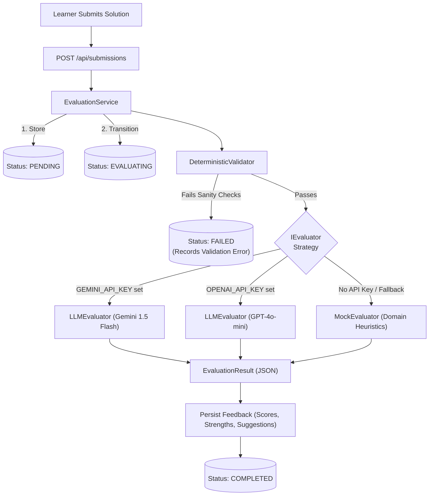

# 🏛️ LLD Arena - Low-Level Design Practice Platform

An interactive, full-stack web application designed for software engineers and learners to practice **Low-Level Object-Oriented System Design (LLD)**, implement solutions in code or architectural blueprints, and receive structured rubric-based feedback.

---

## 🌟 Features

- **Standard Problem Catalogue**: Pre-seeded with 3 industry-standard LLD challenges:
  1. *Design a Parking Lot System* (Multi-level, spot allocation strategies, tiered pricing, concurrency).
  2. *Design an Elevator Control System* (High-rise multi-car dispatcher, LOOK/SCAN algorithms, state machines).
  3. *Design a Vending Machine* (Classic GoF State Pattern, cash register, inventory, refund logic).
- **Split-Pane Developer Workspace**:
  - **Left Pane**: Real-world scenario description, interactive functional requirements checklist, physical constraints, rubric scoring weights, and past attempts history.
  - **Right Pane**: Monaco Editor (`vs-dark`), multi-language starter templates (Java, TypeScript, Python, C++, Text), line/character metrics, and format toggle.
- **Hybrid Evaluation Pipeline**:
  - **Deterministic Validator**: Fast sanity checks (content length, non-empty, structural OOP keywords) before invoking heavy evaluation.
  - **Structured Rubric Evaluator**: Evaluates design across 4 pillars (0-100 points):
    1. *SOLID Principles* (0 - 25 pts)
    2. *Class Responsibilities & Modularity* (0 - 25 pts)
    3. *Extensibility & Design Patterns* (0 - 25 pts)
    4. *Edge Cases & Concurrency / Error Handling* (0 - 25 pts)
  - **Intelligent Heuristic Fallback**: Evaluates OOP constructs, design patterns, and domain entities automatically even if external LLM API keys are not supplied.
  - **Gemini / OpenAI Integration**: Seamlessly switches to Google Gemini or OpenAI when `GEMINI_API_KEY` or `OPENAI_API_KEY` is provided.
- **Detailed Feedback & Iteration**:
  - Visual circular score gauge with dynamic color tiers.
  - Granular rubric breakdown cards with progress bars.
  - Color-coded badges for **Strengths** (green), **Concerns & Code Smells** (amber/rose), and **Actionable Suggestions** (sky blue).
  - 1-click **"Try Again / Refine Design"** action that preloads the submitted code back into the workspace editor for rapid iterative learning.

---

## 🏗️ Architecture & Core Domain Design

The backend exemplifies clean Low-Level Design and OOP principles with strict separation of concerns:

```
lld-practice-platform/
├── backend/
│   ├── src/
│   │   ├── config/env.ts              # Environment configuration
│   │   ├── db/
│   │   │   ├── connection.ts          # SQLite connection and schema init
│   │   ├── domain/
│   │   │   └── types.ts               # Domain models (Problem, Submission, Feedback)
│   │   ├── repositories/              # Repository Pattern (DIP)
│   │   │   ├── ProblemRepository.ts
│   │   │   ├── SubmissionRepository.ts
│   │   │   └── FeedbackRepository.ts
│   │   ├── evaluator/                 # Strategy Pattern & Evaluation Pipeline
│   │   │   ├── IEvaluator.ts          # Strategy Interface
│   │   │   ├── DeterministicValidator.ts  # Sanity & structural validation
│   │   │   ├── LLMEvaluator.ts        # Gemini & OpenAI JSON-schema evaluator
│   │   │   ├── MockEvaluator.ts       # Domain heuristic fallback evaluator
│   │   │   └── EvaluationService.ts   # Pipeline coordinator & state transitions
│   │   ├── controllers/
│   │   │   ├── ProblemController.ts
│   │   │   └── SubmissionController.ts
│   │   ├── routes/
│   │   │   ├── problemRoutes.ts
│   │   │   └── submissionRoutes.ts
│   │   ├── seed/
│   │   │   └── seedProblems.ts        # 3 detailed LLD problems with rubrics
│   │   ├── tests/
│   │   │   ├── deterministicValidator.test.ts # Validation rules
│   │   │   ├── submissionState.test.ts # State transitions & failure handling
│   │   │   └── api.test.ts            # Supertest API integration tests
│   │   ├── app.ts                     # Express app factory with Dependency Injection
│   │   └── server.ts                  # Server entry point
├── frontend/
│   ├── src/
│   │   ├── api/client.ts              # API client
│   │   ├── components/
│   │   │   ├── Navbar.tsx             # Navigation header with rubric guide modal
│   │   │   ├── Badge.tsx              # Difficulty, status, and format badges
│   │   │   ├── ScoreGauge.tsx         # SVG Circular score visualization
│   │   │   ├── RubricBreakdown.tsx    # 4-pillar score cards
│   │   │   └── AttemptHistory.tsx     # Past submissions timeline
│   │   ├── pages/
│   │   │   ├── CataloguePage.tsx      # Problem listing, search, and difficulty filters
│   │   │   ├── PracticePage.tsx       # Split-pane workspace with Monaco editor
│   │   │   └── FeedbackPage.tsx       # Comprehensive evaluation report
│   │   ├── App.tsx                    # Route state orchestrator
│   │   └── main.tsx
├── package.json                       # Monorepo scripts (dev, seed, test, build)
├── README.md
└── AI_USAGE.md
```

### Evaluator Engine (Strategy Pattern)


---

## 🚀 Quickstart Guide

### Prerequisites
- [Node.js](https://nodejs.org/) v18 or higher (Node 22 recommended)
- `npm` v9 or higher

### 1. Installation
In the repository root:
```bash
# Install root orchestration tools
npm install

# Install backend dependencies
npm --prefix backend install

# Install frontend dependencies
npm --prefix frontend install
```

### 2. Seed Database
Populate the 3 foundational LLD problems with specs, constraints, and rubrics:
```bash
npm run seed
```

### 3. Run Automated Tests
Run the Vitest suite covering validation rules, state transitions, and API endpoints:
```bash
npm test
```
*Expected: All 13 tests pass.*

### 4. Start Development Server
Launch both the Express backend and React Vite frontend concurrently:
```bash
npm run dev
```

- **Frontend App**: [http://localhost:5173](http://localhost:5173)
- **Backend API**: [http://localhost:3001](http://localhost:3001)
- **Health Check**: [http://localhost:3001/api/health](http://localhost:3001/api/health)

---

## ⚙️ Environment Configuration

By default, the platform runs completely **out-of-the-box without requiring external API keys** thanks to the built-in intelligent heuristic `MockEvaluator`.

To activate live LLM evaluation via Google Gemini or OpenAI:
1. Create or edit `backend/.env`:
   ```env
   PORT=3001

   # Option A: Google Gemini
   GEMINI_API_KEY=your_gemini_api_key_here

   # Option B: OpenAI
   OPENAI_API_KEY=your_openai_api_key_here
   ```
2. Restart the dev server (`npm run dev`).

---

## 📡 REST API Reference

| Method | Endpoint | Description |
|---|---|---|
| `GET` | `/api/problems` | List all seeded LLD problems with attempt counts and best scores |
| `GET` | `/api/problems/:id` | Retrieve detailed problem specs, requirements, constraints, and rubric |
| `POST` | `/api/submissions` | Submit a solution attempt (`{ problemId, solutionContent, format, language }`) |
| `GET` | `/api/submissions/:id` | Get submission status and linked rubric feedback |
| `GET` | `/api/problems/:id/attempts` | Fetch all historical attempts for a specific problem |
| `GET` | `/api/health` | Health check probe |

---

## 🧪 Testing Coverage

The test suite in `backend/src/tests/` verifies:
- **`deterministicValidator.test.ts`**:
  - Rejection of empty or whitespace-only submissions.
  - Rejection of content below 40 characters.
  - Validation of OOP structural keywords (classes, interfaces, functions).
  - Validation of architectural text terminology.
- **`submissionState.test.ts`**:
  - State progression: `PENDING` -> `EVALUATING` -> `COMPLETED`.
  - Proper error capture when validation fails (`PENDING` -> `FAILED`).
  - Resilient error handling when evaluator throws (`PENDING` -> `FAILED` without server crash).
- **`api.test.ts`**:
  - Supertest HTTP integration for problem retrieval and full submission lifecycle.
